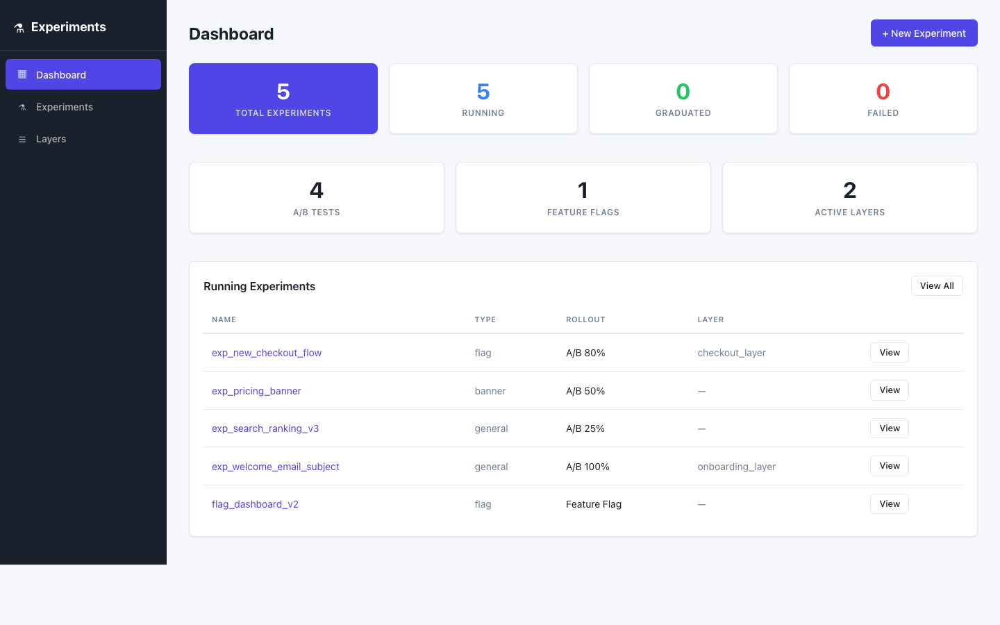
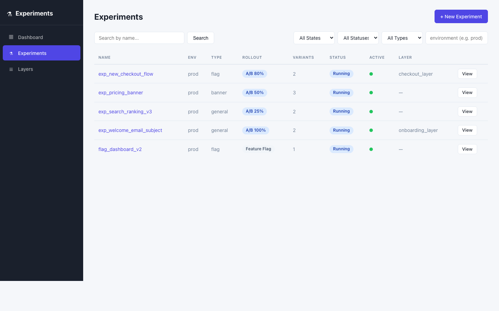
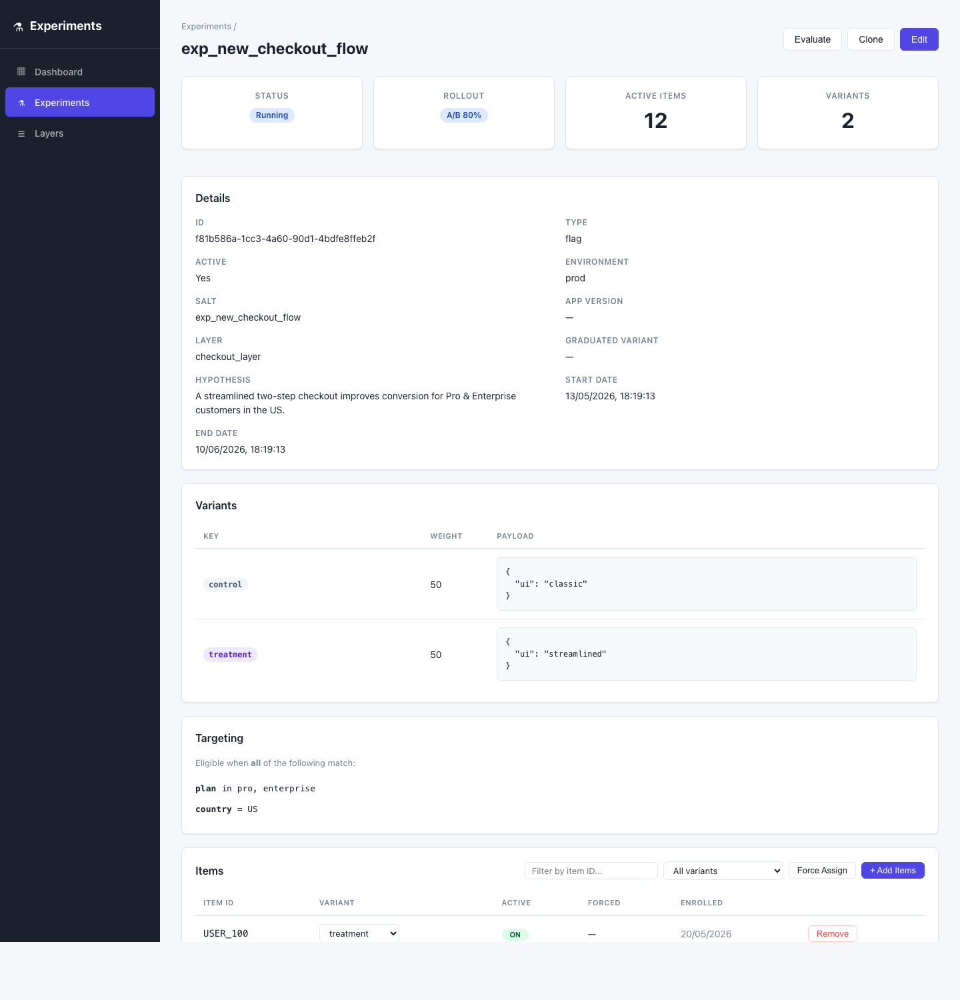
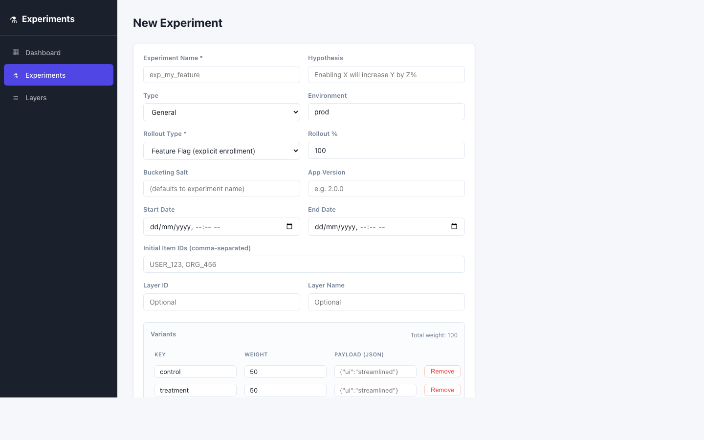
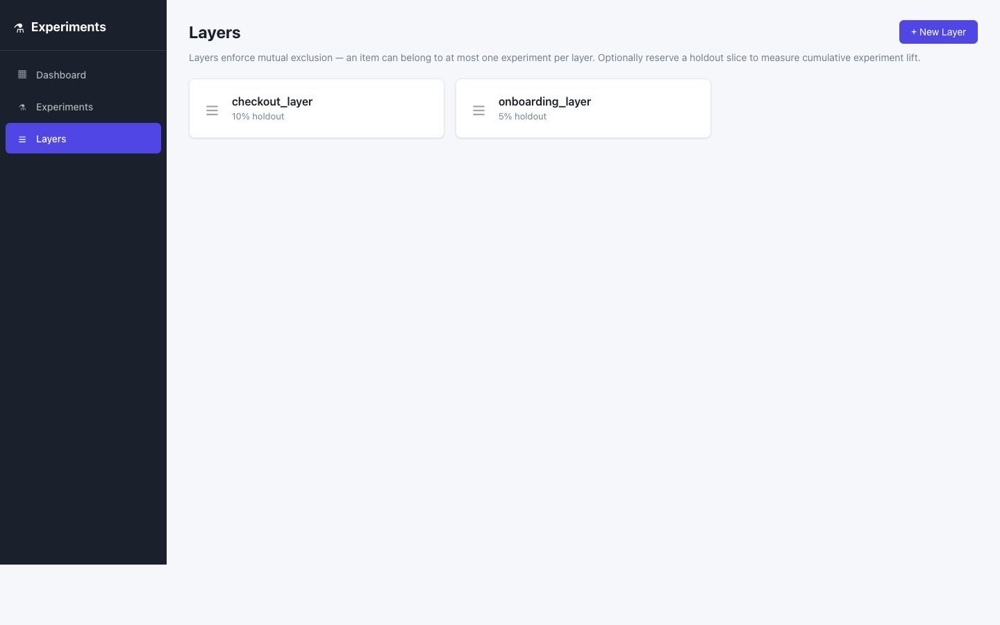
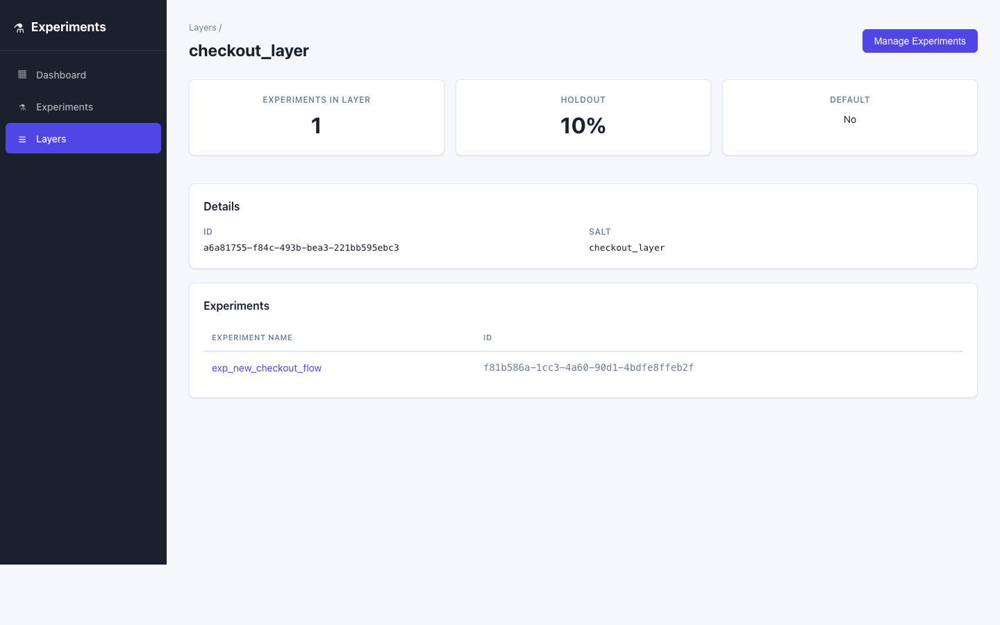

<div align="center">

# Mendel Framework

**A production-grade A/B testing & feature flag framework for Node.js**

Deterministic bucketing · Mongoose-backed storage · Layered mutual exclusion · Drop-in Express routes · React admin UI

[](./LICENSE)
[](https://nodejs.org/)
[](https://mongoosejs.com/)
[](https://expressjs.com/)
[](./CONTRIBUTING.md)

[Quickstart](#-quickstart) · [Features](#-features) · [Docs](#-api-reference) · [Admin UI](#-admin-ui) · [Examples](./examples) · [Contributing](./CONTRIBUTING.md)

</div>

---

## 📖 About

**Mendel Framework** is a batteries-included experimentation and feature-flagging platform you embed in your Node.js application. It is purpose-built for teams that want **GrowthBook / LaunchDarkly-style capabilities without the SaaS dependency or vendor lock-in** — everything runs on your own Mongo cluster, behind your own auth, in your own VPC.

Named after [Gregor Mendel](https://en.wikipedia.org/wiki/Gregor_Mendel) — the father of modern genetics, who pioneered the concept of controlled experiments on inherited traits — the framework brings the same rigor to product experimentation: deterministic, reproducible, statistically sound.

The framework is **completely generic**. It carries no business concepts. Audience selection is expressed as **targeting rules** over an attribute bag the caller supplies at evaluation time. Bucketing is deterministic, so the same `(experiment, item)` pair always resolves to the same variant — across servers, across regions, across SDKs.

---

## ✨ Features

- **🎯 Deterministic bucketing** — FNV-1a hashing keeps `(salt, item_id)` → variant assignments stable across servers and over time. No coordination required between the server and a client SDK.
- **🚦 Two rollout modes** — `A_B_TESTING` for probabilistic bucketing into weighted variants, and `FEATURE_FLAG` for explicit per-item enrollment.
- **🎚 Rich targeting rules** — `eq`, `in`, `gt(e)`, `lt(e)`, `contains`, `starts_with`, `ends_with`, `regex`, `exists` and more, combined with `all` / `any` semantics.
- **🧬 Layers & holdouts** — Group experiments into a layer to enforce mutual exclusion, with optional global holdouts for measuring cumulative lift.
- **🔗 Prerequisites** — Gate one experiment on another experiment's variant assignment.
- **🛡 Force-assign & QA overrides** — Pin specific items to specific variants for QA, demos, or customer escalations.
- **📦 Variant payloads** — Ship arbitrary JSON payloads alongside each variant (copy, config, feature toggles).
- **📊 Exposure & audit logging** — Stream every evaluation and mutation through configurable hooks; optionally persist them to MongoDB.
- **⚡ Built-in TTL cache** — Hot-path `getConfigData` reads are cached in-process with automatic invalidation on writes.
- **🌐 Express integration** — Drop-in client and admin route mounting with `celebrate` validation (optional dependency).
- **🖥 React admin UI** — Manage experiments, layers, items, and overrides through a fully functional dashboard.
- **🐳 Docker-ready** — `docker compose up` to bring up Mongo + backend + UI in seconds.

---

## 🖼 Admin UI

The bundled admin UI gives non-engineers a safe surface for managing experiments end-to-end.

### Dashboard — at-a-glance experiment health



Running / graduated / failed counts, a breakdown of A/B tests vs. feature flags vs. active layers, and a quick-jump table of running experiments.

### Experiment list — search, filter, clone



Filter by name, state, status, type, or environment. Rollout, variant count, layer membership and active-state are all visible at a glance.

### Experiment detail — variants, targeting, items



A single page covers everything about an experiment: status, rollout, variant weights & payloads, targeting rules, layer assignment, and the live list of enrolled items — including force-assign and per-item variant overrides.

### Experiment form — create or edit



A guided form for setting up new experiments — rollout type, salt, dates, variants with JSON payloads, targeting rules, prerequisites, and layer assignment.

### Layers — mutual exclusion + holdout

<table>
  <tr>
    <td></td>
    <td></td>
  </tr>
</table>

Group experiments into a layer to enforce mutual exclusion across audiences. Carve out a global holdout slice so you can measure cumulative lift from everything in the layer.

---

## 🚀 Quickstart

### 1. Install

```bash
npm install mendel-framework mongoose
# Optional — only required if you mount the Express admin routes.
npm install celebrate
```

> Requires **Node.js ≥ 22** and a reachable **MongoDB** instance.

### 2. Initialize

```js
const mongoose = require('mongoose');
const { v4: uuid } = require('uuid');
const { createMendelFramework, ROLL_OUT_TYPE, TARGETING_OP } = require('mendel-framework');

await mongoose.connect(process.env.MONGO_URI);

const { service, manager } = createMendelFramework(mongoose, {
  generateId      : uuid,
  environment     : 'prod',
  cache           : { enabled: true, ttlMs: 5000, max: 1000 },
  persistAudit    : true,
  persistExposure : false,

  onAuditEvent    : (event, payload) => console.log(`[audit] ${event}`, payload),
  onExposure      : (e) => console.log(`[exposure] ${e.exp_name} → ${e.variant_key}`),
});
```

### 3. Create an experiment

```js
await service.createExperiment({
  exp_name      : 'exp_new_checkout',
  hypothesis    : 'Streamlined checkout improves conversion for enterprise customers.',
  exp_type      : 'flag',
  roll_out_type : ROLL_OUT_TYPE.A_B_TESTING,
  roll_out_value: 80,                                   // 80% of eligible traffic participates
  variants: [
    { key: 'control',   weight: 50, payload: { ui: 'classic' } },
    { key: 'treatment', weight: 50, payload: { ui: 'streamlined' } },
  ],
  targeting: {
    match: 'all',
    rules: [
      { attribute: 'plan',    op: TARGETING_OP.IN, values: ['pro', 'enterprise'] },
      { attribute: 'country', op: TARGETING_OP.EQ, values: 'US' },
    ],
  },
  start_date: Date.now(),
  end_date  : Date.now() + 30 * 24 * 60 * 60 * 1000,
}, { id: 'admin' });
```

### 4. Evaluate flags in application code

```js
const attributes = { plan: 'enterprise', country: 'US', tier: 3 };

// Full evaluation — variant + reason + payload
const result = await service.evaluate('exp_new_checkout', 'USER_42', attributes);
// → { variant: 'treatment', reason: 'bucketed', exp_id: '…', payload: { ui: 'streamlined' } }

// Convenience helpers
const variant   = await service.getVariant('exp_new_checkout', 'USER_42', attributes);
const isEnabled = await service.isEnabled('exp_new_checkout', 'USER_42', attributes);

// Batch lookup for an SDK / mobile client
const config = await manager.getConfigData(['USER_42', 'ORG_7'], attributes);
```

### 5. Wire up Express (optional)

```js
const express = require('express');
const {
  express: { ExperimentController, mountRoutes, mountAdminRoutes },
} = require('mendel-framework');

const app = express();
app.use(express.json());

const controller = new ExperimentController({
  experimentService : service,
  experimentManager : manager,
});

const clientRouter = express.Router();
mountRoutes(clientRouter, controller);
app.use('/api/v1', clientRouter);

const adminRouter = express.Router();
mountAdminRoutes(adminRouter, controller, {
  authMiddleware: yourAuthMiddleware,
});
app.use('/api/admin', adminRouter);
```

See [`examples/integration.js`](./examples/integration.js) for the full annotated walk-through.

---

## 🐳 Run the full stack locally

```bash
docker compose up --build
```

Brings up:

| Service | URL                                                  |
| ------- | ---------------------------------------------------- |
| UI      | http://localhost:3100/                               |
| Backend | http://localhost:3000/ (proxied through the UI)      |
| Mongo   | mongodb://localhost:27017/mendel-framework           |

Tear down with `docker compose down` (preserves data) or `docker compose down -v` (drops the volume).

---

## 📚 API Reference

### `createMendelFramework(mongoose, opts)`

One-shot factory that wires up models, the `ExperimentService` (mutations + evaluation), and the `ExperimentManager` (cached batch reads).

| Option            | Type       | Default | Notes                                                                 |
| ----------------- | ---------- | ------- | --------------------------------------------------------------------- |
| `generateId`      | `Function` | —       | **Required.** Used to mint document `_id`s (e.g. `uuid.v4`).          |
| `environment`     | `string`   | `'prod'`| Scopes evaluation to experiments tagged with the same environment.    |
| `cache`           | `object`   | —       | `{ enabled, ttlMs, max }` — in-process TTL cache for `getConfigData`. |
| `persistAudit`    | `boolean`  | `false` | Mirror audit events to `ExperimentAudit` collection.                  |
| `persistExposure` | `boolean`  | `false` | Mirror every evaluation to `ExperimentExposure` collection.           |
| `onAuditEvent`    | `Function` | noop    | `(event, payload) => void` — stream to your analytics pipeline.       |
| `onExposure`      | `Function` | noop    | `(event) => void` — typically forwarded to Segment / Amplitude / BQ.  |
| `onItemsChanged`  | `Function` | noop    | `(expName, item, action) => void` — side-effects on enrollment.       |

### Core services

- **`service.createExperiment(data, auditUser)`**
- **`service.updateExperiment(expId, data, auditUser)`**
- **`service.cloneExperiment(expId, overrides, auditUser)`**
- **`service.addItems(expId, itemIds, auditUser, opts)`** / **`addItemsBulk`**
- **`service.removeItem(expId, itemId, auditUser)`**
- **`service.forceAssign(expName, itemId, variantKey, auditUser)`**
- **`service.evaluate(expName, itemId, attributes, opts)`** — returns `{ variant, reason, payload, exp_id }`
- **`service.getVariant(expName, itemId, attributes)`**
- **`service.isEnabled(expName, itemIdOrIds, attributes)`**
- **`service.assignVariant(expName, itemId, attributes)`** — probabilistic enrollment + persist
- **`service.createLayer(data, auditUser)`** / **`assignToLayer(layerId, expIds, auditUser)`**
- **`manager.getConfigData(itemIds, attributes)`** — batched lookup with cache

### Constants

```js
const {
  EXP_TYPE,         // banner | flag | general
  ROLL_OUT_TYPE,    // A_B_TESTING | FEATURE_FLAG
  SUCCESS_STATUS,   // RUNNING | SUCCESS | FAILURE
  EXPOSURE_REASON,  // not_found | inactive | bucketed | enrolled | targeting_miss | …
  TARGETING_OP,     // eq | in | gt | contains | regex | …
  TARGETING_MATCH,  // all | any
} = require('mendel-framework');
```

### Express routes

| Method | Path                                  | Purpose                                         |
| ------ | ------------------------------------- | ----------------------------------------------- |
| `GET`  | `/api/v1/config-data`                 | Batch evaluation for a list of item IDs         |
| `POST` | `/api/v1/evaluate`                    | Evaluate a single `(exp_name, item_id)` pair    |
| `POST` | `/api/v1/assign-variant`              | Probabilistic enrollment + persist              |
| `GET`  | `/api/admin/experiments`              | List / search experiments                       |
| `POST` | `/api/admin/experiment/setup`         | Create experiment                               |
| `POST` | `/api/admin/experiment/:id`           | Update experiment                               |
| `POST` | `/api/admin/experiment/:id/clone`     | Clone experiment                                |
| `POST` | `/api/admin/experiment/add-items/:id` | Add items to experiment                         |
| `POST` | `/api/admin/experiment/force-assign`  | Pin item → variant                              |
| `GET`  | `/api/admin/layer` / `/layer/:id`     | List / get layers                               |
| `POST` | `/api/admin/layer`                    | Create layer                                    |

---

## 🧠 How bucketing works

Every variant assignment in Mendel Framework is **stateless and deterministic**:

```
bucket = FNV-1a(`${salt}:${item_id}`) / 2^32       ∈ [0, 1)
```

- `salt` defaults to the experiment name, but can be customized so two experiments with overlapping audiences don't share bucket space.
- The rollout check uses a separate suffix (`${salt}:rollout`) so an item's eligibility decision is independent of which variant it lands in once eligible.
- Holdout selection uses `${layerSalt}:holdout`, again independent from variant bucketing.

This means a **client SDK** with the same hashing logic can evaluate flags identically to the server without round-tripping — perfect for mobile, edge, or SSR.

---

## 🤝 Contributing

We love contributions of all sizes — bug reports, feature ideas, docs improvements, and pull requests are all welcome.

Read [**CONTRIBUTING.md**](./CONTRIBUTING.md) for development setup, branching conventions, commit style, and the PR checklist.

---

## 📜 License

Mendel Framework is released under the [MIT License](./LICENSE).

---

<div align="center">

If Mendel Framework helps your team ship safer experiments, please ⭐ the repo — it really does help.

</div>
